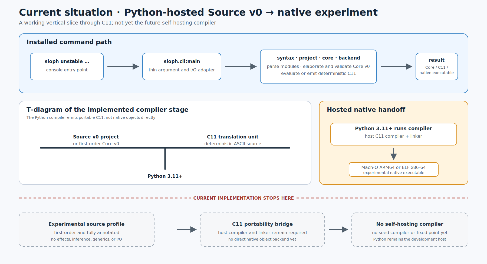
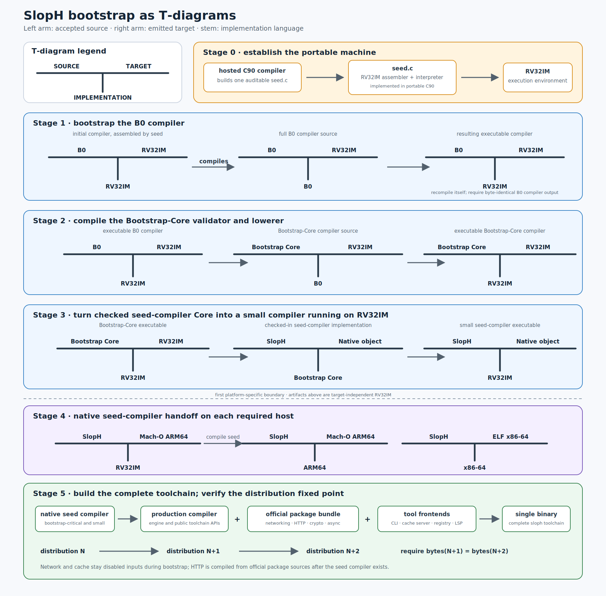

# Reproducible Source Bootstrap

This document records a future source-first bootstrap path for the language
toolchain. It is a reproducibility and trust goal, not a prerequisite for
starting the first compiler implementation.

The design is inspired by [live-bootstrap][live-bootstrap]: begin with one
small, auditable seed and climb through narrowly scoped stages, each only
powerful enough to build and verify the next. This project assumes an existing
hosted ANSI C compiler rather than beginning with handwritten machine-code
seeds or bootstrapping an operating system.

The details below are a design direction. The B0 grammar, bootstrap host ABI,
flat-image encoding, orchestration mechanism, and exact resource budgets remain
deferred until the Core and runtime semantics are sufficiently stable.

## Goals

- Build the compiler from auditable source without depending on an opaque
  previous compiler binary.
- Use the same target-independent bootstrap sources on Apple Silicon macOS and
  AMD64 Linux.
- Make every stage deterministic, bounded, inspectable, and independently
  testable.
- Keep the permanent C trust root to one small file.
- Verify that checked-in seed-compiler Core corresponds to seed-compiler
  source.
- Reach a byte-identical native distribution fixed point.
- Require no registry, network, populated cache, or downloaded binary artifact.

## Non-Goals

- This is not the fastest route to the first working compiler.
- It does not bootstrap the operating system, C compiler, C library, or system
  linker.
- It does not require developers to run interpreted bootstrap stages during
  ordinary compiler development.
- It does not make RISC-V the normal application target for v1.
- It does not require the bootstrap implementation to support every Core
  feature used by arbitrary programs.

## Trust Root

The initial assumed environment contains:

- a hosted ANSI C90 compiler and its linker;
- the ANSI C90 standard library;
- an operating system capable of ordinary file input and output;
- the bootstrap source tree;
- one C source file named conceptually `seed.c`.

The same `seed.c` must compile on:

- macOS on ARM64 Apple Silicon;
- Linux on AMD64 x86-64.

The seed may use hosted C90 file and allocation facilities. It may not require
C99 fixed-width integers, `long long`, compiler extensions, inline assembly,
POSIX-specific APIs, target-specific object formats, or platform-specific
system calls.

The C compiler and linker remain trusted inputs in this path. A later project
may reduce that trust root further, but doing so is outside this language's
bootstrap scope.

## Current Implementation: Hosted Python Vertical Slice

The current executable is not yet a self-hosting stage of the source-bootstrap
chain. It is a hosted Python 3.11+ implementation of the experimental Source v0
and Core v0 profiles. The installed `sloph` entry point invokes a thin Python
CLI, which delegates to libraries for source parsing, module loading,
elaboration to Core v0, Core processing, and deterministic C11 emission. A host
C compiler turns that C11 into the first experimental native executables.



This vertical slice is a real, deliberately restricted compiler path, but it is
not the future compiler shown below: Source v0 is first-order and fully
annotated, and C11 plus the host toolchain is a portability bridge rather than
the final object backend. Python is therefore still a development host, not the
permanent bootstrap seed or an implementation language that must appear in the
reproducible source-bootstrap trust root.

## Bootstrap Products

The bootstrap does not attempt to implement the complete user-facing toolchain
in B0 or Bootstrap Core. It first produces a deliberately small **seed
compiler**. This is distinct from `seed.c`: `seed.c` only establishes the
portable RV32IM environment, while the seed compiler understands enough SlopH
to build the production compiler from authored source.

The seed compiler contains only the facilities required to cross the trust
gap:

- the source and Core frontend needed by production compiler source;
- mandatory `core`-library support and the required runtime boundary;
- deterministic native object generation for the bootstrap targets;
- enough package-graph and link-plan handling to build declared local sources;
- no registry client or server, HTTP stack, remote cache, language server, or
  other network-dependent tool.

After the native seed compiler exists, it builds the production compiler
engine. That engine builds the independently versioned official packages and
links the complete single-binary toolchain. In the proposed library layering,
HTTP, networking, crypto providers, and cache/registry service code belong to
the official package bundle rather than the mandatory `core` library. The
toolchain may link those packages into its distributed executable without
making them bootstrap dependencies or implicit dependencies of user programs.

Conceptually, the two products are:

```text
bootstrap chain -> small native seed compiler

small native seed compiler
    -> production compiler engine
    -> official package bundle (networking, HTTP, crypto, ...)
    -> CLI, package client, cache/registry server, LSP, ...
    -> complete single-binary toolchain
```

The complete binary must still build correctly from local declared sources
with an empty cache and no network. Its HTTP cache server is a tool it can
build and run, never an input required to establish the compiler.

## Bootstrap Chain

The chain can be expressed as compiler tombstone diagrams. In each T, the left
arm is the accepted source language, the right arm is the emitted target, and
the stem is the language or machine implementing that compiler. The C90 seed is
shown separately because it establishes the RV32IM assembler and interpreter
rather than compiling the later language directly.



The equivalent linear sequence is:

```text
hosted C90 compiler
        |
        v
one auditable seed.c
        |
        | assemble and interpret
        v
portable RV32IM bootstrap machine
        |
        | compile and self-check
        v
tiny structured B0 language
        |
        | validate and lower
        v
restricted Bootstrap-Core profile
        |
        | compile checked-in seed-compiler Core
        v
small seed compiler running on RV32IM
        |
        | emit target-native object
        v
Mach-O ARM64 on macOS | ELF x86-64 on Linux
        |
        | first link using the host C toolchain
        v
native seed compiler
        |
        | build production compiler and official packages
        v
complete single-binary toolchain
        |
        | rebuild complete distribution until fixed point
        v
byte-identical release distribution
```

Every transition consumes declared files and produces content-addressed
artifacts. A manifest records the ordered stages, exact input hashes, expected
output hashes, resource limits, and the tool responsible for each transition.
The manifest syntax and execution mechanism remain deferred.

## Stage 0: The C90 Seed

`seed.c` contains only the permanent machinery needed to enter the portable
bootstrap environment:

- a minimal assembler for a strict canonical subset of RISC-V assembly;
- an RV32IM interpreter;
- a loader for the tiny bootstrap image;
- bounded linear memory;
- a small deterministic host-call boundary;
- error reporting sufficient to identify malformed bootstrap input.

It does not contain the B0 compiler, Core compiler, native backends, package
manager, optimizer, or copies of later-stage source files.

The seed normalizes every register and arithmetic result to 32 bits. It may use
an ANSI C `unsigned long` internally only after verifying that it has at least
32 value bits. The seed requires eight-bit bytes. Operations whose correct C
implementation could otherwise depend on signed overflow, right-shift rules,
or out-of-range conversions must be implemented using defined unsigned
operations.

The seed traps on:

- invalid or unsupported instructions;
- instruction or data misalignment;
- out-of-bounds instruction fetch, load, or store;
- division by zero and specified RISC-V arithmetic edge cases when required;
- malformed images and invalid labels or relocations;
- unsupported host calls;
- configured instruction, memory, file, or output limits being exceeded.

## Portable Bootstrap ISA

The bootstrap machine is:

```text
RV32IM
little-endian
unprivileged
32 integer registers
standard 32-bit instruction encodings
strictly aligned instruction and data access
```

RV32I is designed to be sufficient as a compiler target and has fixed 32-bit
base instructions. The ratified `M` extension supplies integer multiplication
and division, which materially improves compiler workloads without requiring
64-bit state in the C90 seed. See the [RV32I specification][rv32i] and
[M-extension specification][riscv-m].

The bootstrap excludes compressed, atomic, floating-point, vector, CSR,
privileged, and nonstandard instruction extensions. Instructions such as
`FENCE` that have no observable effect in the single-threaded bootstrap
environment receive an explicitly documented behavior rather than inheriting
host behavior accidentally.

Bootstrap functions follow the standard RISC-V ILP32 integer calling
convention, including its register roles, argument registers, return registers,
callee-saved registers, and stack rules. This makes generated code inspectable
with independent RISC-V tools and avoids inventing a private calling
convention. See the [RISC-V psABI][riscv-psabi].

The RISC-V specifications intentionally leave the system-call ABI to an
execution environment. This project therefore defines a small Bootstrap
Environment Interface over `ECALL` for only the services required by the chain,
such as bounded file access, arguments, deterministic status reporting, and
exit. Exact operations and numbers remain deferred. They may not expose ambient
network access, wall-clock time, randomness, unrestricted processes, or
undeclared environment state.

## Bootstrap Image

Early stages use standard RV32IM instruction encodings inside a tiny
project-defined flat image rather than ELF. The container carries only what the
seed needs, conceptually:

- magic and format version;
- entry address;
- code and read-only data lengths;
- initialized data and zero-filled memory lengths;
- total requested memory and stack limits;
- optional integrity information.

The final layout, integer encoding, maximum sizes, and integrity fields remain
deferred. The format must be documented, length-delimited, deterministic, and
safe to validate before allocation. It must contain no host pointers,
timestamps, absolute workspace paths, or platform-specific metadata.

ELF is deliberately excluded from the C seed. Test tools may translate or wrap
a bootstrap image for execution by independent RISC-V emulators, but that
translation is not part of the trusted bootstrap path.

## Stage 1: Tiny Structured B0

B0 is a bootstrap-only, first-order systems language. Its purpose is to make
the Bootstrap-Core implementation readable without requiring a large compiler
to be written in RISC-V assembly.

B0 should provide only what is demonstrated necessary for parsers, validators,
arena-backed data structures, and code emitters. Likely facilities include:

- explicit 8-bit and 32-bit integer values;
- explicit pointers, slices, records, and fixed layouts;
- named functions with the ILP32 calling convention;
- locals, conditionals, loops, selection, calls, and returns;
- checked indexing and explicit loads and stores;
- global constant byte data;
- manual arena allocation through a small B0 runtime;
- deterministic file and diagnostic operations through the bootstrap host ABI.

B0 excludes inference, generics, macros, closures, typeclasses, floats,
concurrency, exceptions, automatic memory management, operator overloading,
implicit conversion, and target-dependent behavior.

The B0 syntax has not been selected. It must favor a very small assembler-
written parser, canonical serialization, local readability, and predictable AI
generation. B0 is not a user-facing subset of the final language and does not
constrain future surface syntax.

The initial B0 compiler is written in RV32IM assembly. It compiles the fuller
B0 compiler written in B0. The B0 compiler then recompiles itself; the two
outputs must be byte-identical before the chain proceeds.

## Stage 2: Bootstrap Core

A B0 program implements a validator and lowerer for a restricted profile of the
canonical typed Core described in [CORE.md](../language/CORE.md). It consumes canonical
textual Core and emits the portable RV32IM bootstrap image.

The currently implemented [experimental Core v0](../language/CORE_V0.md) is
not this Bootstrap-Core profile. It has no ownership, memory operations,
effects, layout, or backend semantics and cannot compile the compiler. It is a
hosted experiment whose corpus may later inform a separately versioned
Bootstrap-Core contract.

Bootstrap Core is a profile, not another semantic language. It uses exactly the
meaning of the corresponding public Core forms and primitives but may reject
features unnecessary for compiling the compiler itself. The profile must be
listed explicitly and may grow only when the compiler source demonstrates a
need.

The Bootstrap-Core implementation must validate at least:

- schema and Core version compatibility;
- resolved identities, scope, and binding structure;
- explicit types and function applications;
- constructor and case correctness;
- permitted primitive signatures;
- layouts and ILP32 lowering rules;
- ownership invariants retained at this Core phase;
- resource and recursion limits;
- absence of unsupported Core forms, primitives, and effects.

It need not perform source parsing, macro expansion, name resolution, type
inference, optimization, package resolution, or native code generation.

## Checked-In Seed-Compiler Core

The repository stores a canonical textual Core snapshot of the small seed
compiler. This is an auditable derived source artifact, not an opaque
executable. It is compiled by the B0 Bootstrap-Core implementation into an
RV32IM image of the seed compiler.

The snapshot includes:

- an exact Core schema and primitive-catalog version;
- hashes of compiler source and all semantic inputs;
- no optimizer-private metadata;
- no absolute paths, timestamps, caches, or undeclared environment data;
- only constructs permitted by the Bootstrap-Core profile.

The resulting seed compiler must compile its corresponding authored source back
to canonical Core. That output must equal the checked-in snapshot after removal
of explicitly non-semantic provenance fields. A difference fails the bootstrap
before native generation.

Changes to seed-compiler source that alter canonical Core must update the
snapshot through an independently reviewable regeneration step. The change
shows both the authored source diff and canonical Core diff.

## Native Handoff

The seed compiler first runs as an RV32IM bootstrap program. From the same
seed-compiler source and Core semantics it emits a native object for the host:

- Mach-O ARM64 for Apple Silicon macOS;
- ELF x86-64 for AMD64 Linux.

This is the first platform-specific stage. The compiler supplies the native
instruction selection, object writer, ABI metadata, runtime objects, and symbol
information required by the documented target. The linker accompanying the
assumed C toolchain may perform the first native link.

Using the system linker here does not make it a normal language semantic
dependency. The exact linker identity and arguments are recorded as bootstrap
inputs. A later internal linker may replace it when that improves independence
without delaying the initial reproducible chain.

The target-independent RV32IM artifacts produced before this handoff must be
byte-identical on macOS and Linux. Native artifacts differ by target but must be
reproducible within the same declared target and linker environment.

## Production Toolchain and Native Fixed Point

The newly linked native seed compiler first builds the production compiler
engine from local source. The production compiler then builds the selected
official package bundle and all tool frontends and links the complete
single-binary toolchain. Hosted packages used only by these tools may include
networking, HTTP, TLS or crypto bindings, and the verified cache/registry
server. They are outside the mandatory `core` library and outside the
bootstrap-critical seed compiler.

The complete toolchain recompiles the same compiler, package, and frontend
sources. The result then recompiles those inputs again. The last two
release-mode distributions must be byte-for-byte identical.

Conceptually:

```text
RV seed compiler compiles seed source -> native seed compiler
native seed compiles compiler source  -> production compiler
production compiler builds distribution -> distribution N
distribution N rebuilds distribution    -> distribution N+1
distribution N+1 rebuilds distribution  -> distribution N+2

require bytes(distribution N+1) == bytes(distribution N+2)
```

The comparison covers the compiler executable, standard toolchain libraries,
public schemas, interfaces, embedded runtime objects, and other distributed
artifacts. Detached provenance records may differ only in explicitly excluded
fields and may not affect executable or semantic content.

## Verification

The full bootstrap verification must include:

1. Compile `seed.c` with independent conforming C compilers where available.
2. Use each seed to assemble and execute the same RV32IM stages.
3. Compare every target-independent output by content hash.
4. Differentially test instruction semantics against an independent RISC-V
   implementation.
5. Run official or derived RV32I and M instruction vectors, including boundary
   and trap cases.
6. Require the B0 compiler to reach a byte-identical self-hosted fixed point.
7. Validate the checked-in seed-compiler Core independently in B0.
8. Require the seed compiler to reproduce its checked-in Core from source.
9. Build the native seed compiler and then the production toolchain on macOS
   ARM64 and Linux x86-64.
10. Require the final two native rebuilds to be byte-identical per target.
11. Run the language conformance, Core-validation, backend-equivalence, and CLI
    suites with the fixed-point compiler.
12. Repeat with empty caches, no network, and no registry artifacts.

Malformed images, invalid Core, resource exhaustion, hash mismatches, Core
snapshot differences, native fixed-point differences, or undeclared inputs are
hard failures. The verification report identifies the first divergent stage
and preserves its inputs and outputs for inspection.

The seed interpreter and assembler should also be tested with randomized and
property-based inputs outside the bootstrap trust path. External assemblers,
disassemblers, and emulators are test oracles only and are never required to
complete the canonical bootstrap.

## Development and Release Policy

Ordinary compiler development uses the latest trusted production compiler and
the fast library-first workflow described in [CLI.md](./CLI.md). It does not
rerun the interpreted chain after every edit.

The complete source-to-fixed-point bootstrap runs:

- nightly on macOS ARM64 and Linux x86-64;
- for every release candidate;
- for every final compiler release;
- whenever the C seed, RISC-V profile, image format, B0 compiler,
  Bootstrap-Core profile, runtime ABI, or checked-in seed-compiler Core changes.

A release is not reproducibly bootstrapped until both required host paths pass.
Release provenance publishes the source hashes, stage graph, tool identities,
artifact hashes, resource measurements, and fixed-point comparisons.

## Deferred Decisions

- The exact canonical RISC-V assembly syntax accepted by `seed.c`.
- The B0 grammar, type rules, and source layout.
- The flat bootstrap-image schema and limits.
- The Bootstrap Environment Interface operations and numeric identifiers.
- Bootstrap manifest syntax and orchestration.
- How the single system-linker handoff is invoked without enlarging the C
  seed unnecessarily.
- The exact Bootstrap-Core subset and primitive catalog.
- Compiler-source restrictions required to remain within Bootstrap Core.
- Native object, runtime, and linker requirements for each initial target.
- Concrete instruction, memory, output-size, and wall-time budgets.
- Diverse-double-compilation and additional compiler-backdoor defenses.
- Whether a later stage removes the assumed system linker from the trust root.

These choices may not weaken the one-file C90 seed, portable target-independent
stages, explicit trust accounting, source-to-Core comparison, or native fixed-
point requirements.

## References

- [live-bootstrap][live-bootstrap]
- [Bootstrappable Builds][bootstrappable]
- [RISC-V RV32I specification][rv32i]
- [RISC-V M extension][riscv-m]
- [RISC-V ELF psABI and ILP32 calling convention][riscv-psabi]
- [Zig's C and WebAssembly bootstrap design][zig-bootstrap]
- [Rust staged bootstrapping][rust-bootstrap]
- [Go source bootstrapping][go-bootstrap]

[live-bootstrap]: https://github.com/fosslinux/live-bootstrap
[bootstrappable]: https://www.bootstrappable.org/
[rv32i]: https://docs.riscv.org/reference/isa/v20260120/unpriv/rv32.html
[riscv-m]: https://docs.riscv.org/reference/isa/unpriv/m-st-ext.html
[riscv-psabi]: https://riscv-non-isa.github.io/riscv-elf-psabi-doc/
[zig-bootstrap]: https://ziglang.org/news/goodbye-cpp/
[rust-bootstrap]: https://rustc-dev-guide.rust-lang.org/building/bootstrapping/what-bootstrapping-does.html
[go-bootstrap]: https://go.dev/doc/install/source
